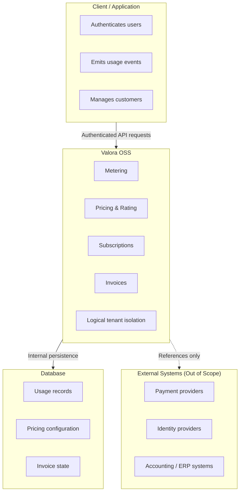

# Valora OSS — Architecture

## Overview

Valora OSS is an open-source **billing engine** focused on **billing logic correctness**.

It is designed to extract billing concerns—usage metering, pricing, rating, subscriptions, and invoice generation—out of application code and into a **dedicated, deterministic engine**.

Valora OSS is intentionally **not** a payment processor.
It computes *what should be billed*, not *how money is collected*.

This document describes how Valora OSS is structured, where its boundaries are, and why those boundaries exist.

---

## What Valora OSS Is (and Is Not)

Valora OSS **is**:

- A billing computation engine
- A control plane for pricing and usage-based billing
- A deterministic system for producing invoices and billing states

Valora OSS **is not**:

- A payment gateway
- A merchant of record
- A financial settlement system
- An infrastructure or operations platform

This distinction is fundamental to every architectural decision in Valora.

---

## Architectural Intent

The architecture of Valora OSS is driven by three core intents:

1. **Billing logic must be isolated**
   Billing rules change faster than product logic. Hardcoding them into application flows creates long-term risk.
2. **Billing must be deterministic**
   Given the same inputs—usage, pricing configuration, subscription state, and time—Valora must always produce the same result.
3. **Trust boundaries must be explicit**
   High-risk domains (payments, credentials, infrastructure) are deliberately kept outside the engine.

---

## High-Level Structure

At a high level, Valora OSS sits between the application and external financial systems.

The application:

- Owns users and authentication
- Emits usage
- Executes payments

Valora OSS:

- Validates and aggregates usage
- Applies pricing and rating rules
- Manages subscription and invoice state

External systems:

- Execute payments
- Handle identity
- Perform accounting or reconciliation

Valora OSS never crosses into payment execution.

---

## Core Runtime Flow

A typical billing lifecycle in Valora OSS looks like this:

1. The application defines billing primitives:

   - Products
   - Meters
   - Prices (flat, usage-based, tiered, hybrid)
   - Subscriptions
2. The application sends usage events to Valora OSS.
3. Valora OSS:

   - Validates usage against meter definitions
   - Aggregates usage per billing period
   - Applies pricing and rating logic
   - Computes billable line items
4. At the billing boundary:

   - An invoice is generated
   - Totals and line items are finalized
   - Invoice state transitions are recorded
5. The application consumes the invoice output and performs payment execution externally.

At no point does Valora OSS store or process payment credentials.

---

## Internal Composition

Internally, Valora OSS is structured in layered responsibilities:

- **API layer**

  - Handles HTTP/gRPC transport
  - Enforces authentication and authorization
  - Performs request validation
  - Contains no billing logic
- **Application / service layer**

  - Orchestrates billing workflows
  - Coordinates domain operations
  - Enforces state transitions and invariants
- **Domain layer**

  - Pricing models and rating logic
  - Subscription lifecycle rules
  - Invoice state machines
  - Designed to be deterministic and transport-agnostic
- **Persistence layer**

  - Stores usage records, pricing configuration, subscription state, and invoices
  - Abstracted behind repositories
  - Assumes database security is handled by the deployment environment

This separation exists to keep billing logic testable, auditable, and transferable.

---

## Trust Boundaries

Valora OSS operates across clearly defined trust boundaries.

The diagram above highlights Valora OSS trust boundaries.
All billing decisions are performed within Valora OSS.
External systems are referenced but never invoked for billing computation or state transitions.

## Key Boundary Decisions:

- Valora OSS never executes payments
- External identifiers are treated as opaque references
- All billing decisions happen inside Valora OSS
- Tenant isolation is enforced at the application level

These boundaries intentionally reduce security, compliance, and operational scope.

---

## Multi-Tenancy Model

Valora OSS uses **logical multi-tenancy**.

- Every operation is scoped to an organization (tenant)
- Authorization is enforced on all read and write paths
- No assumption is made about physical database isolation

Physical isolation strategies (separate databases, schemas, clusters) are left to the adopting system.

---

## Determinism and Auditability

Billing outputs are derived solely from persisted inputs and configuration, not from external side effects.

Valora OSS is designed so that:

- Billing outcomes are reproducible
- State transitions are explicit
- Invoices represent a stable snapshot of inputs at a point in time

This makes billing behavior explainable and auditable, even as pricing models evolve over time.

---

## Explicit Non-Goals

Valora OSS intentionally does not attempt to solve:

- Payment retries or settlement guarantees
- Fraud detection
- Tax calculation or regulatory compliance
- Infrastructure security or SLA enforcement
- Identity or credential management

These concerns are delegated to systems better suited to handle them.

---

## Deployment Context (OSS)

Valora OSS is self-hosted software.

The adopting organization is responsible for:

- Infrastructure security and networking
- TLS termination and rate limiting
- Secrets management
- Database operations, backups, and monitoring

Valora OSS makes minimal assumptions about its runtime environment to remain portable.

---

## Closing Note

Valora OSS is designed to be **boring in execution and strict in boundaries**.

By focusing on billing correctness, deterministic behavior, and explicit trust separation, Valora OSS remains:

- Composable
- Auditable
- Replaceable
- Transferable as an asset

This architecture favors long-term clarity over short-term convenience.
